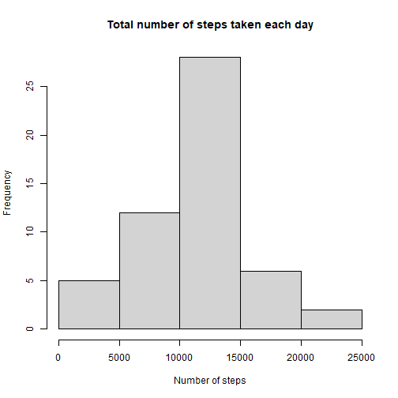
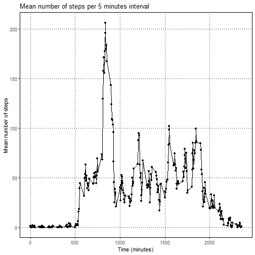
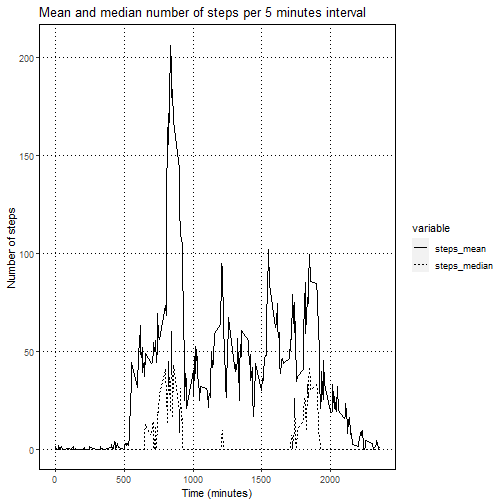
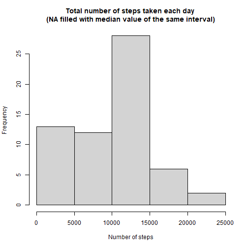
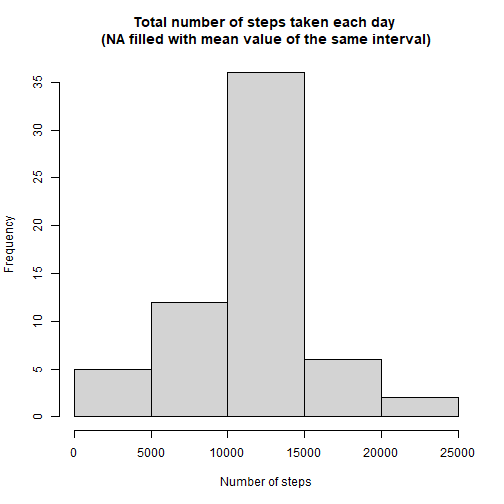
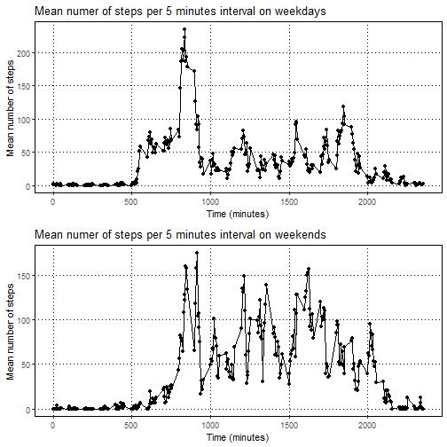

Activity monitoring data
============================================================
# 1- Load packages and setwd


```r
library(knitr)
library(ggplot2)
library(data.table)
library(gridExtra)
setwd("C:/Users/camil/Desktop/DataScience/ReproducibleResearch-Week2")
```

# 2- Download file


```r
url<-"https://d396qusza40orc.cloudfront.net/repdata%2Fdata%2Factivity.zip"
download.file(url, "amd.zip")
```

First check the files that will be unzipped


```r
unzip("amd.zip", list=T)
```

```
##           Name Length                Date
## 1 activity.csv 350829 2014-02-11 10:08:00
```

Unzip the right file

```r
unzip("amd.zip")
```

# 3- Open and check table

```r
 amd<-read.csv("activity.csv")
```
 Check length and header names
 

```r
 dim(amd)
```

```
## [1] 17568     3
```

```r
 colnames(amd)
```

```
## [1] "steps"    "date"     "interval"
```
# 4- Number of steps taken per day 

## 4-1- Total number of steps taken each day


```r
StepsDaySum<-tapply(amd$steps, amd$date, sum)
StepsDaySum<-as.data.frame(StepsDaySum)
colnames(StepsDaySum)<-c("steps")
StepsDaySum$date<-rownames(StepsDaySum)
rownames(StepsDaySum)<-seq_along(StepsDaySum$steps)
head(StepsDaySum)
```

```
##   steps       date
## 1    NA 2012-10-01
## 2   126 2012-10-02
## 3 11352 2012-10-03
## 4 12116 2012-10-04
## 5 13294 2012-10-05
## 6 15420 2012-10-06
```

## 4-2- Histogram of total number of steps taken each day

```r
StepsDaySum_hist<-hist(StepsDaySum$steps, main="Total number of steps taken each day", xlab="Number of steps")
```



```r
StepsDaySum_hist
```

```
## $breaks
## [1]     0  5000 10000 15000 20000 25000
## 
## $counts
## [1]  5 12 28  6  2
## 
## $density
## [1] 1.886792e-05 4.528302e-05 1.056604e-04 2.264151e-05 7.547170e-06
## 
## $mids
## [1]  2500  7500 12500 17500 22500
## 
## $xname
## [1] "StepsDaySum$steps"
## 
## $equidist
## [1] TRUE
## 
## attr(,"class")
## [1] "histogram"
```

## 4-3- Mean and median of total numer of steps taken each day

```r
StepsDaySum_mean<-mean(StepsDaySum$steps, na.rm=T)
StepsDaySum_median<-median(StepsDaySum$steps, na.rm = T)
StepsDaySum_mean
```

```
## [1] 10766.19
```

```r
StepsDaySum_median
```

```
## [1] 10765
```

# 5- Average daily activity pattern

## 5-1- Time series plot (5-min interval x average number of steps taken across all days)

First prepare the dataset

```r
StepsIntMean<-tapply(amd$steps, amd$interval, mean, na.rm=T)
StepsIntMean<-as.data.frame(StepsIntMean)
colnames(StepsIntMean)<-c("steps_mean")
StepsIntMean$interval<-rownames(StepsIntMean)
StepsIntMean$interval<-as.numeric(StepsIntMean$interval)
rownames(StepsIntMean)<-seq_along(StepsIntMean$interval)
head(StepsIntMean)
```

```
##   steps_mean interval
## 1  1.7169811        0
## 2  0.3396226        5
## 3  0.1320755       10
## 4  0.1509434       15
## 5  0.0754717       20
## 6  2.0943396       25
```
Then create the graph

```r
StepsIntMean_ggplot<-ggplot(data=StepsIntMean, aes(x=interval, y=steps_mean))+
    geom_point()+geom_line()+
    ggtitle("Mean number of steps per 5 minutes interval")+
    xlab("Time (minutes)")+ylab("Mean number of steps")+
    theme(panel.background = element_rect(fill = "white",colour = "white"),
          panel.grid.major = element_line(size = 0.2, linetype = 3,colour = "black"),
          panel.border = element_rect(fil=NA, colour="black"))
StepsIntMean_ggplot
```



## 5-2- Which 5-min interval, on average across all the days in the dataset, contains the maximum number of steps ? 

```r
StepsIntMean[StepsIntMean$steps_mean==max(StepsIntMean$steps_mean),]
```

```
##     steps_mean interval
## 104   206.1698      835
```

# 6- Inputing missing values
## 6-1- Calculate and report total number of missing values in the dataset

```r
sum(is.na(amd$steps)==TRUE)
```

```
## [1] 2304
```

## 6-2- Strategy for filling in
First look where the NA are mostly represented -- this result is very long and not printed: 

```r
is.na(amd$steps)
```
It looks like entire days are missing values, how many days is it ?

```r
sum(is.na(StepsDaySum$steps)==TRUE)
```

```
## [1] 8
```
How many obersvations are there per day again ?

```r
length(unique(amd$interval))
```

```
## [1] 288
```
Are all the missing informations coming from single days missing values ?

```r
sum(is.na(StepsDaySum$steps)==TRUE)*length(unique(amd$interval))
```

```
## [1] 2304
```

Yes. 
Two strategies are available to fill the NA values: fill each interval with either the mean or median value of the same time interval, to do that let's first see if the mean and median values are comparable.

We add a median column to the StepsIntMean dataset

```r
StepsIntMean$steps_median<-as.numeric(tapply(amd$steps, amd$interval, median, na.rm=T))
```

Let´s add a line to the graph: 

```r
StepsIntMean$steps_median<-as.numeric(tapply(amd$steps, amd$interval, median, na.rm=T))
StepsInt<-melt.data.table(as.data.table(StepsIntMean), id.vars=c("interval"))
    
StepsInt_ggplot<-ggplot(data=StepsInt)+
    geom_line(aes(x=interval,y=value,linetype=variable))+
    ggtitle("Mean and median number of steps per 5 minutes interval")+
    xlab("Time (minutes)")+ylab("Number of steps")+
    theme(panel.background = element_rect(fill = "white",colour = "white"),
          panel.grid.major = element_line(size = 0.2, linetype = 3,colour = "black"),
          panel.border = element_rect(fil=NA, colour="black"))
StepsInt_ggplot
```



The mean seems to be much higher than the median, and would probably skew the data towards hight values if the NA were filled in with the mean. However let´s make both datasets to see. 

## 6-3- Create a new dataset with filled in missing values

Fill in NAs with the median value of each interval and check if it worked

```r
amd2<-copy(amd)
for (i in amd2$interval) {
    amd2[amd2$interval==i & is.na(amd2$steps)==T, c("steps")]<-StepsIntMean[StepsIntMean$interval==i,c("steps_median")]
}
head(amd2)
```

```
##   steps       date interval
## 1     0 2012-10-01        0
## 2     0 2012-10-01        5
## 3     0 2012-10-01       10
## 4     0 2012-10-01       15
## 5     0 2012-10-01       20
## 6     0 2012-10-01       25
```

Fill in NAs with the mean value of each interval and check if it worked

```r
amd3<-copy(amd)
for (i in amd3$interval) {
    amd3[amd3$interval==i & is.na(amd3$steps)==T, c("steps")]<-StepsIntMean[StepsIntMean$interval==i,c("steps_mean")]
}
head(amd3)
```

```
##       steps       date interval
## 1 1.7169811 2012-10-01        0
## 2 0.3396226 2012-10-01        5
## 3 0.1320755 2012-10-01       10
## 4 0.1509434 2012-10-01       15
## 5 0.0754717 2012-10-01       20
## 6 2.0943396 2012-10-01       25
```

## 6-4- Histogram of total number of steps taken each day

Missing values filled with the median value of the same interval:

```r
StepsDaySum2<-tapply(amd2$steps, amd2$date, sum)
StepsDaySum2<-as.data.frame(StepsDaySum2)
colnames(StepsDaySum2)<-c("steps")
StepsDaySum2$date<-rownames(StepsDaySum2)
rownames(StepsDaySum2)<-seq_along(StepsDaySum2$steps)

StepsDaySum2_hist<-hist(StepsDaySum2$steps, main="Total number of steps taken each day \n(NA filled with median value of the same interval)", xlab="Number of steps")
```



```r
StepsDaySum2_hist
```

```
## $breaks
## [1]     0  5000 10000 15000 20000 25000
## 
## $counts
## [1] 13 12 28  6  2
## 
## $density
## [1] 4.262295e-05 3.934426e-05 9.180328e-05 1.967213e-05 6.557377e-06
## 
## $mids
## [1]  2500  7500 12500 17500 22500
## 
## $xname
## [1] "StepsDaySum2$steps"
## 
## $equidist
## [1] TRUE
## 
## attr(,"class")
## [1] "histogram"
```

Missing values filled with the mean value of the same interval:

```r
StepsDaySum3<-tapply(amd3$steps, amd3$date, sum)
StepsDaySum3<-as.data.frame(StepsDaySum3)
colnames(StepsDaySum3)<-c("steps")
StepsDaySum3$date<-rownames(StepsDaySum3)
rownames(StepsDaySum3)<-seq_along(StepsDaySum3$steps)

StepsDaySum3_hist<-hist(StepsDaySum3$steps, main="Total number of steps taken each day \n(NA filled with mean value of the same interval)",xlab="Number of steps")
```



```r
StepsDaySum3_hist
```

```
## $breaks
## [1]     0  5000 10000 15000 20000 25000
## 
## $counts
## [1]  5 12 36  6  2
## 
## $density
## [1] 1.639344e-05 3.934426e-05 1.180328e-04 1.967213e-05 6.557377e-06
## 
## $mids
## [1]  2500  7500 12500 17500 22500
## 
## $xname
## [1] "StepsDaySum3$steps"
## 
## $equidist
## [1] TRUE
## 
## attr(,"class")
## [1] "histogram"
```

To compare, histogram with missing values: 

```r
StepsdaySum_hist<-hist(StepsDaySum$steps, main="Total number of steps taken each day", xlab="Number of steps")
```


## 6-5- Mean and median of total number of steps taken each day

Missing values filled with the median value of the same interval:

```r
StepsDaySum2_mean<-mean(StepsDaySum2$steps, na.rm=T)
StepsDaySum2_median<-median(StepsDaySum2$steps, na.rm = T)
StepsDaySum2_mean
```

```
## [1] 9503.869
```

```r
StepsDaySum2_median
```

```
## [1] 10395
```

Missing values filled with the median value of the same interval:

```r
StepsDaySum3_mean<-mean(StepsDaySum3$steps, na.rm=T)
StepsDaySum3_median<-median(StepsDaySum3$steps, na.rm = T)
StepsDaySum3_mean
```

```
## [1] 10766.19
```

```r
StepsDaySum3_median
```

```
## [1] 10766.19
```

To compare, mean and median with missing values: 

```r
StepsDaySum_mean
```

```
## [1] 10766.19
```

```r
StepsDaySum_median
```

```
## [1] 10765
```

### 6-5-1- Do these values differ from the first estimates ?

If the missing values are filled in with the median value of each interval, they differ by about 500 steps, so approximately 5% of the total number of steps. 
If the missing values are filled in with the mean value of each interval, the mean value doesn´t change, which is awaited and the median is also almost the same.

### 6-5-2- What is the impact of imputing missing data on the estimates of the total daily number of steps ? 

If one inputs missing data from the mean value of the same time interval, one probably slightly overestimates the total number of steps taken, however the overestimation is not that significant when considered over the whole day. If one considers times at which a relatively low numbers of steps are taken, such as for example in the hours after midnight, then the results are strongly skewed when filled in by the mean, as the mean is falsely raised by outliers.

# 7-Differences in activity patterns between weekdays and weekends

## 7-1- New factor variable 

The extra "day" variable was created as a control. 

```r
amd$day<-weekdays(as.Date(amd$date))
amd$we<-weekdays(as.Date(amd$date))
weekdays<-c("Monday","Tuesday","Wednesday","Thursday","Friday")
amd[is.element(amd$we, weekdays)==F,c("we")]<-c("weekend")
amd[is.element(amd$we, weekdays)==T,c("we")]<-c("weekday")
```

## 7-2- Time series plot

I chose to separate my dataframe into two separate data frames, make the graphics and arrange them together afterwards.

First the dataframe and timeseries plot for weekdays: 

```r
amdwd<-amd[is.element(amd$day, weekdays)==T,]

StepsIntWD<-tapply(amdwd$steps, amdwd$interval, mean, na.rm=T)
StepsIntWD<-as.data.frame(StepsIntWD)
colnames(StepsIntWD)<-c("steps_mean")
StepsIntWD$interval<-rownames(StepsIntWD)
StepsIntWD$interval<-as.numeric(StepsIntWD$interval)
rownames(StepsIntWD)<-seq_along(StepsIntWD$interval)

StepsIntWD_ggplot<-ggplot(data=StepsIntWD, aes(x=interval, y=steps_mean))+
    geom_point()+geom_line()+
    ggtitle("Mean numer of steps per 5 minutes interval on weekdays")+
    xlab("Time (minutes)")+ylab("Mean number of steps")+
    theme(panel.background = element_rect(fill = "white",colour = "white"),
          panel.grid.major = element_line(size = 0.2, linetype = 3,colour = "black"),
          panel.border = element_rect(fil=NA, colour="black"))
```

Then the dataframe and timeseries plot for weekends:

```r
amdwe<-amd[is.element(amd$day, weekdays)==F,]                                  

StepsIntWE<-tapply(amdwe$steps, amdwe$interval, mean, na.rm=T)
StepsIntWE<-as.data.frame(StepsIntWE)
colnames(StepsIntWE)<-c("steps_mean")
StepsIntWE$interval<-rownames(StepsIntWE)
StepsIntWE$interval<-as.numeric(StepsIntWE$interval)
rownames(StepsIntWE)<-seq_along(StepsIntWE$interval)

StepsIntWE_ggplot<-ggplot(data=StepsIntWE, aes(x=interval, y=steps_mean))+
    geom_point()+geom_line()+
    ggtitle("Mean numer of steps per 5 minutes interval on weekends")+
    xlab("Time (minutes)")+ylab("Mean number of steps")+
    theme(panel.background = element_rect(fill = "white",colour = "white"),
          panel.grid.major = element_line(size = 0.2, linetype = 3,colour = "black"),
          panel.border = element_rect(fil=NA, colour="black"))
```

Then merge the graphis: 

```r
StepsIntMerge_ggplot<-grid.arrange(StepsIntWD_ggplot, StepsIntWE_ggplot)
```


